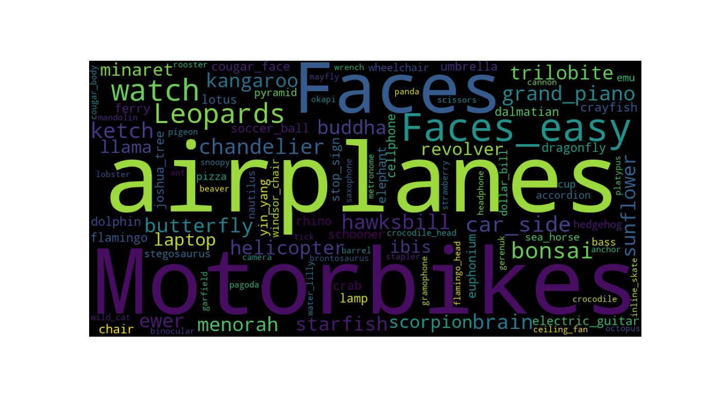

[Read Supporting Blog](https://www.ashishlotake.com/blog/active-labelling-system)
# Supported Images for labelling



# Understanding Deployment


# Set to run locally

1. Clone the repo
```
git clone https://github.com/ashishlotake/Automated-data-labelling-system-with-active-learning.git
```
2. Cd into cloned directory
```
cd Automated-data-labelling-system-with-active-learning
```
3. Build docker image name ```labelling-system``` with tag ```v1```
```
docker build -t labelling-system:v1 .
```
4. Run the docker container
```
docker run -p 8501:8501 labelling-system:v1 
```
5. Open ```localhost:8501```

